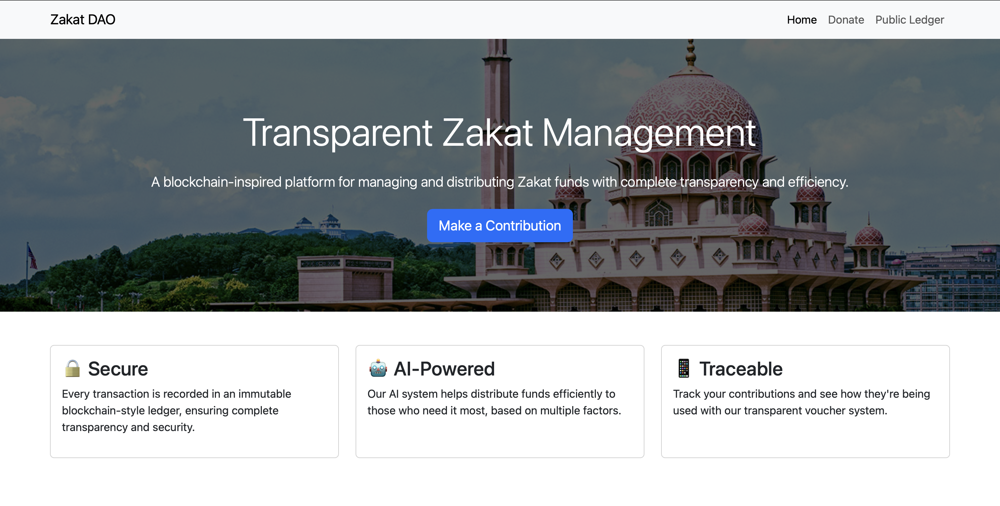

# ZakatDAO

*Decentralized Zakat Distribution Platform by Jien Weng*

Zakat DAO is a decentralized platform built to modernize and automate the distribution of zakat in a **transparent**, **Shariah-compliant**, and **community-driven** way. By integrating blockchain technology, decentralized governance (**DAO**), AI-based prioritization, and e-wallet disbursement, the platform ensures that zakat funds are allocated fairly, securely, and efficiently to those in need.

[](https://zakatdao.onrender.com)

## ZakatDAO Hub
Welcome to the ZakatDAO hub! Here you can find important resources to better understand the platform:

- [Solution Overview PDF](https://jienweng.netlify.app/assets/misc/report-ZakatDAO.pdf)
- [Pitch Deck PDF](https://jienweng.netlify.app/assets/misc/ZakatDao-pitch.pdf)
- [Live Demo](https://zakatdao.onrender.com)
- [Explanation Video](link-to-video)

Else, please find it under the [Documentations Folder](https://github.com/JienWeng/ZakatDAO/tree/main/Documentations).

## Project Overview

This platform implements a transparent Zakat management system with:
- Blockchain-style immutable ledger
- TNG eWallet integration for disbursements
- AI-powered fund distribution
- Smart contract and community-driven platform
- QR code enabled vouchers

## Objectives

- **Transparency**: Every donation, vote, and disbursement is recorded immutably on the blockchain and viewable by the public.
- **Shariah Compliance**: The platform is designed to uphold the principles of Islamic zakat, ensuring fair categorization and distribution to asnaf groups.
- **Decentralized Governance**: Enables donors and stakeholders to participate in decision-making via blockchain-based voting mechanisms.
- **Inclusivity and Accessibility**: Designed to serve not only urban areas but also extend disbursement accessibility to rural and underbanked communities through e-wallet integration and offline vouchers.
- **Efficiency**: Automate disbursements using AI and smart contracts to eliminate the need for intermediaries and traditional organizational structures, lowering the costs. 

---

## Features

### Donor Interface
- Contribute via e-wallet or FPX.
- View live blockchain ledger of all transactions.
- Vote on fund allocation (e.g. education, healthcare).
- Download vouchers showing donation usage.

### AI-Driven Disbursement
- AI scores recipients for fair prioritization.
- Combines donor votes with AI for allocation.
- Manual disbursements require DAO-style voting.

### DAO Governance
- Smart contracts enable transparent community voting.
- Multi-signature for large fund releases.
- All decisions are immutably recorded on-chain.

### Real-World Integration
- Supports TNG, Boost, FPX etc.
- Digital/print vouchers for offline recipients.
- Track disbursements by donors and recipients.

## Setup Instructions

1. Clone and setup environment:
```bash
git clone https://github.com/jienweng/ZakatDAO
cd ZakatDAO
python -m venv venv
source venv/bin/activate  # For Unix/macOS
venv\Scripts\activate     # For Windows
```

2. Install dependencies:
```bash
chmod +x install_dependencies.sh
./install_dependencies.sh
```

## Usage Guide

### Donation Flow
1. Access donation form: `/donate`
2. Fill required details
3. Receive unique voucher
4. Track status in ledger

### Disbursement Flow
1. Admin login: `/admin`
2. Review available funds
3. Choose disbursement method:
   - Manual: `/disburse`
   - AI-powered: `/admin/ai-disbursement`
4. Monitor transactions

### Voucher Usage
1. Recipient receives TNG voucher
2. Uses at partner merchants
3. Transactions logged in `usage.csv`
4. View usage history: `/voucher/<code>/usage`

## API Endpoints

### Public APIs
```
GET /api/ledger.json
- View all transactions
- Filter by type, date, user

GET /voucher/<code>
- Get voucher details
- View usage history
```

### Admin APIs
```
POST /api/disburse
- Disburse funds
- Requires admin auth
- Accepts: recipient_id, amount, zakat_type_id

GET /api/verify-chain
- Verify ledger integrity
- Returns validation status
```

## URL Guide

### Public Pages
```
/ - Home page
/donate - Donation form
/ledger - Public transaction ledger
/voucher/<code> - View specific voucher details
/voucher/<code>/usage - View voucher usage at merchants
```

### Admin Interface
```
/admin - Admin dashboard
/admin/login - Admin login page
/admin/logout - Admin logout
/admin/recipients - Manage recipients
/admin/ai-disbursement - AI-powered disbursement interface
```

### DAO Voting System
```
/proposal/<id> - View disbursement proposal details
/proposal/<id>/vote - Cast vote on proposal (requires auth)
/dao - DAO governance dashboard
/dao/proposals - View all proposals
/dao/allocations - View current allocation policies
/dao/allocations/propose - Propose new allocation policy (admin only)
/dao/vote/<id> - Cast vote on proposal
```

### DAO Governance
- Proposal creation (admin)
- Two types of proposals:
  1. Disbursement proposals
  2. Allocation policy proposals
- Voting rights:
  - Authorities: 50% weight
  - Donors: 50% collective weight
  - Minimum 3 votes required
  - 24-hour voting window
  - 60% approval threshold

### Allocation Voting
1. Admin creates proposal at `/dao/allocations/propose`
2. Proposal includes:
   - Asnaf percentage changes
   - Category assignments
   - Usage priorities
3. Voting process:
   - 24-hour window
   - Both donors and authorities vote
   - Requires 60% weighted approval
4. Implementation:
   - Auto-executes on approval
   - Updates allocation policy
   - Affects future disbursements

### Disbursement Flow
```
/disburse - Manual disbursement form (requires admin)
/disbursement-confirmation - Confirmation page after disbursement
```

### API Endpoints
```
GET /api/ledger.json
    - View all transactions
    - Query params:
        - type: IN/OUT
        - user: filter by user
        - voucher: filter by voucher code
        - start_date: filter from date
        - end_date: filter to date

POST /api/disburse (requires admin)
    - Disburse funds
    - Payload:
        - recipient_id: string
        - amount: float
        - zakat_type_id: int

GET /api/verify-chain
    - Verify ledger integrity
    - Returns validation status and latest block
```

## URL Access Control

### Public Access
- Home page (/)
- Donation form (/donate)
- Public ledger (/ledger)
- Voucher details (/voucher/*)

### Donor Access
- Proposal voting (/proposal/*/vote)
- Usage tracking (/voucher/*/usage)

### Admin Access
- Admin dashboard (/admin)
- Recipient management (/admin/recipients)
- Manual disbursement (/disburse)
- AI disbursement (/admin/ai-disbursement)
- API endpoints (/api/disburse)

### DAO Governance
- Proposal creation (admin)
- Voting rights:
  - Authorities: 50% weight
  - Donors: 50% collective weight
  - Minimum 3 votes required
  - 24-hour voting window
  - 60% approval threshold


## Tech Stack

| Layer               | Technology                                  |
|--------------------|---------------------------------------------|
| Frontend           | React.js, Tailwind CSS                      |
| Backend            | Node.js / Flask (Python)                    |
| Blockchain Layer   | Ethereum / Polygon    |
| Smart Contracts    | Solidity                                     |
| AI Models          | Python (scikit-learn, TensorFlow)            |
| Off-chain Storage  | MongoDB, PostgreSQL, IPFS                    |
| E-Wallet Support   | TNG, Boost, FPX      |
| Deployment         | AWS/Docker backend|

---

## Deploying ZGT Token

1. Install dependencies:
```bash
npm install --save-dev hardhat @nomiclabs/hardhat-waffle @nomiclabs/hardhat-etherscan dotenv
```

2. Set up environment variables in `.env`:
- Get Alchemy API key from https://www.alchemy.com/
- Get Polygonscan API key from https://polygonscan.com/
- Add your wallet private key (without 0x prefix)

3. Get test MATIC:
- Visit https://faucet.polygon.technology/
- Request test MATIC for Mumbai testnet

4. Deploy contract:
```bash
npx hardhat run scripts/deploy.js --network mumbai
```

5. Verify on Mumbai Polygonscan:
- Contract will be automatically verified
- Visit https://mumbai.polygonscan.com/ to view

---

## Contact

- Report issues on GitHub
- Check TROUBLESHOOTING.md
- Contact laijienweng@gmail.com